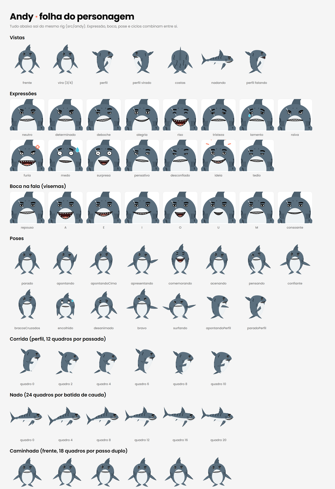

# Andy

Mascote e narrador do Surfzada Explica: um tubarão-tigre casca grossa, que
já viu muito mar.



## Por que ele

- **É da costa brasileira:** o tubarão-tigre aparece do Nordeste ao Sul e é
  um dos tubarões mais conhecidos do país.
- **Tem a cara da marca:** as listras do tigre são desenhadas como ondinhas.
  O coral aparece nos efeitos e na boca aberta; o resto é cinza-azulado e
  branco, que convive bem com a tinta preta e os azuis do mar.
- **Anda em pé e nada:** em pé, gesticula com as barbatanas peitorais e usa
  os lobos da cauda como pés. Na água, nada de verdade, o que serve para as
  cenas dentro do mar.
- **Não é fofo:** tem pálpebra pesada, sobrancelha grossa, sorriso de canto
  com os dentes em zigue-zague, cicatriz no olho esquerdo e um corte na
  barbatana dorsal.

> Cuidado com o tom: em Recife, o tubarão-tigre é associado a incidentes com
> surfistas. O Andy é um veterano do mar, não uma ameaça. Evitar piadas com
> mordida em surfista.

## Regras do personagem

- **É o narrador.** Fala em primeira pessoa, direto e seco, com o bordão
  "O mar não mente." no fim de todo episódio. A boca tem as posições da fala
  (visemas) e sincroniza com o áudio.
- **Assinatura sonora:** um estalo de dentes (`S-clack`) nos momentos de
  "sacou!" e depois do bordão.
- **Está sempre na tela.** Quando a cena é um mapa ou um vídeo real, ele
  aparece no canto, apontando e comentando, como um apresentador do tempo.
- **A boia é o instrumento dele.** Ele a solta na água para medir. Quando a
  onda passa, a boia gira no lugar e não vai junto: é a cena que mostra que
  quem viaja é a energia, não a água.
- **Sempre pisca.** Parado, ele respira de leve e pisca a cada ~3 s, para não
  parecer congelado.

## Rig

O Andy não é um conjunto de desenhos prontos: é um boneco articulado em
código, em [src/compartilhado/personagens/andy](../../src/compartilhado/personagens/andy). Tudo o que ele faz é um
conjunto de números. Assim dá para misturar expressão com pose, interpolar
entre elas e sincronizar a fala.

| Parte | O que controla |
|---|---|
| **Vistas** | Frente (com o rosto virando até quase 3/4), perfil (espelhável), costas e nado (na horizontal) |
| **Expressões** (15) | Neutro, determinado, deboche, alegria, riso, tristeza, lamento, raiva, fúria, medo, surpresa, pensativo, desconfiado, ideia, tédio |
| **Controles do rosto** | Forma do olho, pálpebra, pupila, direção do olhar, ângulo e altura da sobrancelha, efeitos (lágrima, suor, raiva, ideia) |
| **Boca** (8 visemas) | Repouso, A, E, I, O, U, M e consoante. Controlada por abertura, largura, sorriso e canto torto. Fechada, vira o sorriso de dentes em zigue-zague |
| **Poses** (15) | Parado, apontando, apontando para cima, apresentando, comemorando, acenando, pensando, confiante, braços cruzados, encolhido, desanimado, bravo, surfando, e duas de perfil |
| **Controles do corpo** | Inclinação, estica e amassa, pulo, cada barbatana peitoral, cada lobo da cauda, batida da cauda, inclinação da cabeça, queixo e virada do rosto |
| **Ciclos** | Nado, corrida (perfil), caminhada (frente), respiração, aceno, pulo, tremor de medo e piscar |

No nado, o corpo é montado sobre uma espinha que se curva com a batida da
cauda: o contorno, as listras e as barbatanas acompanham a curva, e a
cabeça fica firme.

Para trocar de expressão ou pose sem pulo, `misturaRosto` e `misturaCorpo`
interpolam entre duas. Quando a forma do olho muda, ele pisca no meio da
transição.

Para a fala:
- **`bocaFalando(texto, segundos)`** anima a boca letra por letra, sem áudio.
- **`bocaPelaAmplitude(volume)`** segue o volume da narração gravada.

### Usar numa cena

```tsx
<svg viewBox="0 0 1080 1920">
  <Andy x={540} y={1300} altura={600} expressao="deboche" pose="bracosCruzados" />
  <Andy x={400} y={1650} altura={500} vista="nado" corpo={nado(frame)} />
</svg>
```

Em pé, `x`/`y` são os pés; no nado, o centro do corpo.

### Sprites

Para usar fora do Remotion (CapCut, Canva, stories), `npm run andy:sprites`
exporta 96 PNGs com fundo transparente em `out/andy/sprites/`:
- as vistas, as expressões, os visemas e as poses;
- os quadros do nado (24), da corrida (12) e da caminhada (18).

## Arquivos

- [folha.png](folha.png) — referência de tudo o que o rig faz (composição `andy-folha` no Studio:
  `npx remotion still andy-folha out/andy/folha.png`).
- Propostas anteriores: [boia-conceitos.png](boia-conceitos.png) e
  o pinguim (descartado; no Drive em `arquivo/`). A [boia.svg](boia.svg) segue
  como objeto de cena.
